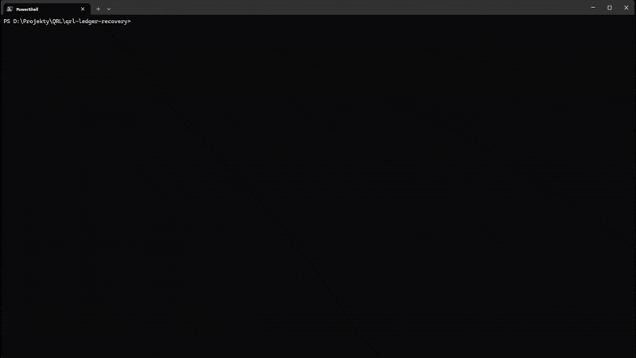

# QRL Ledger Nano S Recovery Tool

Recover your QRL coins from Ledger Nano S devices that no longer support the QRL app due to firmware v2.x incompatibility.

## Demo



[Watch in higher quality (MP4)](demo.mp4)

## ⚠️ Security Warning

- This tool requires your BIP39 mnemonic (recovery phrase)
- Entering your mnemonic compromises **ALL cryptocurrencies** on your Ledger
- Disconnect from the internet before using this tool
- Move all your other crypto assets to new wallets after using this

## Download

Download the binary for your system from [Releases](../../releases):

**Windows:**
- `qrl-ledger-recovery-windows-amd64.exe` (64-bit Intel/AMD)
- `qrl-ledger-recovery-windows-arm64.exe` (ARM64)

**macOS:**
- `qrl-ledger-recovery-darwin-amd64` (Intel)
- `qrl-ledger-recovery-darwin-arm64` (Apple Silicon)

**Linux:**
- `qrl-ledger-recovery-linux-amd64` (64-bit Intel/AMD)
- `qrl-ledger-recovery-linux-arm64` (ARM64)
- `qrl-ledger-recovery-linux-arm` (ARM 32-bit)

**BSD:**
- `qrl-ledger-recovery-freebsd-amd64` (FreeBSD 64-bit)

## How to Use

You can run the tool by simply double-clicking the binary, or from terminal:

**Windows:**
```bash
qrl-ledger-recovery-windows-amd64.exe
```

**macOS/Linux/BSD:**
```bash
chmod +x qrl-ledger-recovery-*
./qrl-ledger-recovery-*
```

The tool will guide you through the process. It will display:
- Tree 1 and Tree 2 QRL addresses
- QRL mnemonics (34 words each)
- QRL hexseeds (102 characters each)

Verify the addresses match your Ledger, then import the keys into the official QRL wallet.

## Build from Source

### Prerequisites

- Install Go from https://go.dev/dl/
- Install Git from https://git-scm.com/install/ (or download the code from GitHub manually)

### Build Steps

```bash
git clone https://github.com/Robyer/qrl-ledger-recovery
cd qrl-ledger-recovery
go mod download
go build -o qrl-ledger-recovery main.go
```

## Resources

- [QRL Website](https://www.theqrl.org)
- [QRL Docs - Ledger Wallet](https://docs.theqrl.org/use/wallet/ledger)

## License

MIT License - see [LICENSE](LICENSE) file for details.

## Disclaimer

This is an emergency recovery tool. Use at your own risk. By using this tool, you accept full responsibility for the security of your assets.